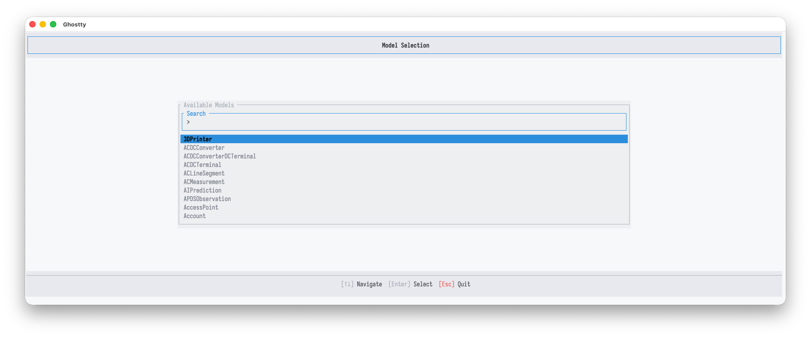
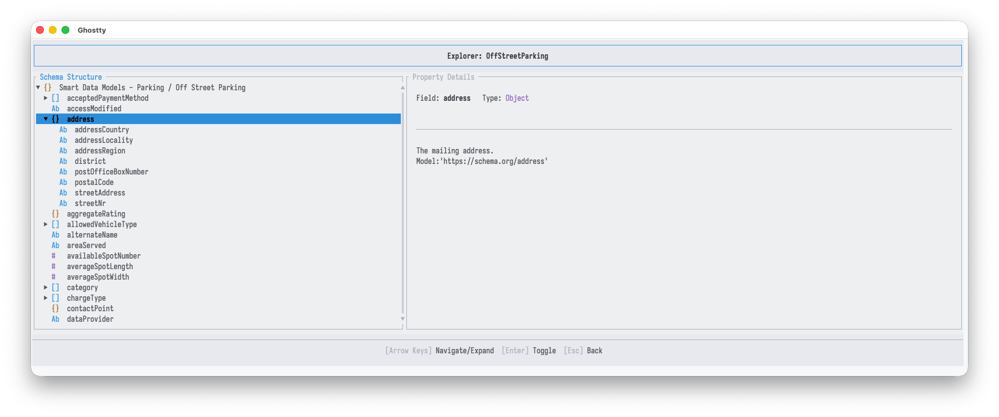
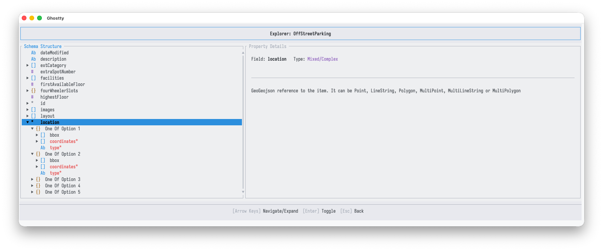
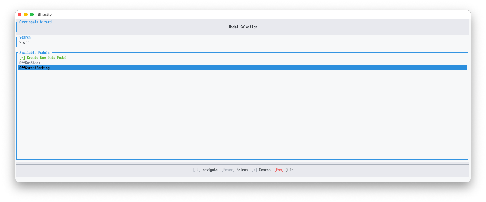
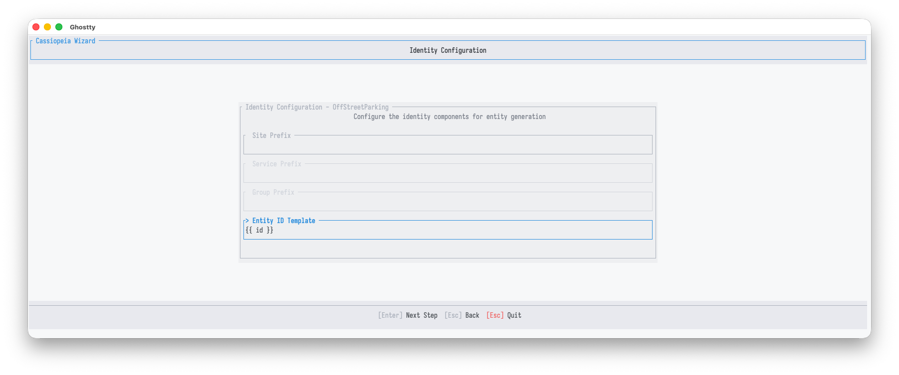
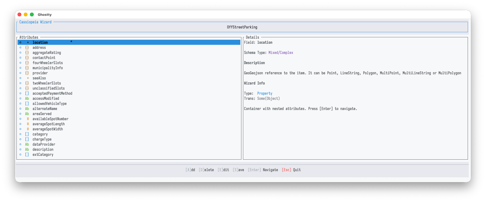
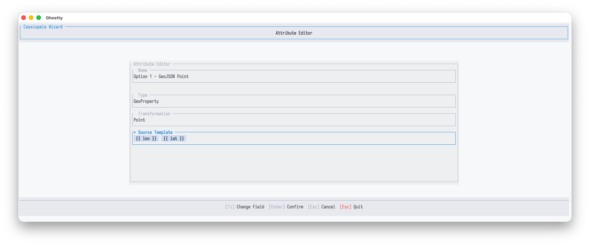
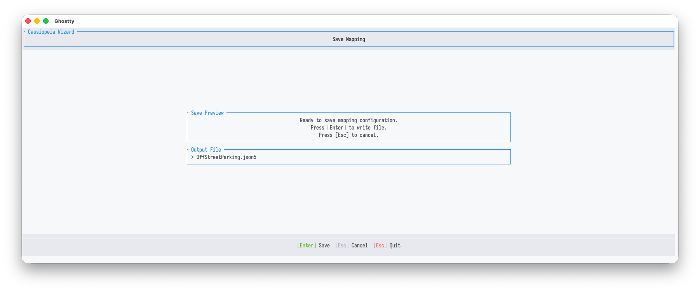

# Terminal interfaces

Cassiopeia ships two interactive terminal interfaces alongside the batch commands. Both help you inspect a target schema and author a mapping. Neither is part of the pipeline itself:

- **Explorer** is a read-only browser for a Smart Data Model schema. Use it to understand a model's shape, attributes, types, and constraints before mapping anything onto it.
- **Wizard** is a guided authoring flow that takes you from a chosen model to a finished `.json5` mapping file. It validates each attribute against the model's schema as you go.

Neither interface reads or writes source data. The Explorer only reads the schema catalogue. The Wizard reads the catalogue and writes one mapping file. Running that mapping against a source is a separate step, covered in the [mapping guide](../guides/mapping.md).

## A local catalogue is required

Both interfaces use the Smart Data Models catalogue stored on disk and work entirely offline once it is present. Populate it first:

```bash
cassiopeia sdm download
```

This fetches the published schema catalogue into the schemas folder. The Explorer reads models from there. The Wizard reads them from there and writes the mapping it produces into the mappings folder. If the catalogue is empty, the model list is empty, so download before launching either interface. Confirm what was fetched with `cassiopeia sdm list`.

## Themes

Both commands use a dark theme by default. Pass `--light` to switch to the light theme used in the screenshots below:

```bash
cassiopeia explorer --light
cassiopeia wizard --light
```

## Shared visual language

The two interfaces share a header, footer, and set of type glyphs, so what you learn in one carries over to the other. The footer always lists the keys active on the current screen. The highlighted key label is followed by its action. `[Esc]` is shown in red because it steps back or quits.

Attribute and schema-node types use the same small glyphs throughout:

| Glyph | Meaning |
|-------|---------|
| `Ab`  | A textual value (string) |
| `#`   | A numeric value (integer or float) |
| `[]`  | An array or list |
| `{}`  | An object with nested members |
| `+`   | A `oneOf` node, a choice between several alternative shapes |
| `*`   | Marks a required attribute |

## Explorer

The Explorer is for inspecting a model schema. Launch it with no arguments to open model selection:

```bash
cassiopeia explorer
```

Start typing to filter the catalogue. The search matches as you type. Move the highlight with the arrow keys and press `[Enter]` to open the selected model. `[Esc]` quits.



Selecting a model opens the schema viewer. The left pane shows the schema as a collapsible tree. The right pane shows the selected node's field name, type, description, and source model. Move with the arrow keys, expand and collapse nodes with `[Enter]`, and press `[Esc]` to return to model selection.



Nodes that the schema defines as a choice between several shapes appear as a `oneOf` parent with each alternative listed beneath it. Geometry-bearing attributes often appear this way. A `location` typed as mixed or complex expands into the GeoJSON geometry variants it may take, and the required members of each option are marked with `*`.



## Wizard

The Wizard turns a target model into a mapping file through a linear flow: pick a model, configure entity IDs, map the attributes, and save. Launch it with no arguments:

```bash
cassiopeia wizard
```

### 1. Model selection

The first step uses the same searchable catalogue as the Explorer, with one addition at the top: `[+] Create New Data Model`. This opens a short name-entry step for authoring a mapping against a model that is not in the catalogue. Filter with `[/]` and the search box, move with the arrow keys, and press `[Enter]` to select. The [data-model guide](../guides/data-models.md) explains the trade-offs between using a catalogue model and creating your own.



### 2. Identity configuration

Next, the Wizard configures how each produced entity's ID is built. The **Entity ID Template** is the active field. It is a template such as `{{ id }}` that is filled per record, with optional site, service, and group prefixes that prepend fixed segments to every ID. Press `[Enter]` to move on to the attributes.



### 3. Attribute list

This is the core of the Wizard. The left pane lists the model's attributes. The right pane shows the selected attribute's details, including a **Wizard Info** block with its NGSI-LD attribute type and current transformation. Each row carries a status dot: a filled dot means the attribute already has a source template, while an open dot means it is still unmapped. The type glyph and the `*` required marker appear as elsewhere.

The footer keys act on the selected attribute: `[A]` adds, `[D]` deletes, `[E]` edits, `[Enter]` navigates into a container attribute, and `[S]` saves the mapping. `[Esc]` quits.



### 4. Attribute editor

Editing an attribute opens a small form with four fields: its **Name**, NGSI-LD **Type** (Property, Relationship, GeoProperty, and so on), the **Transformation** applied to the source value, and the **Source Template** that reads from the record. The source template uses the same language as other mappings. In the example, a GeoProperty is built from two placeholders, one for longitude and one for latitude. Move between fields with the arrow keys. `[Enter]` confirms, and `[Esc]` cancels back to the list.



### 5. Save

The final step previews the mapping and writes it out. The output file is named for the model, uses the `.json5` extension, and is written into the mappings folder. `[Enter]` writes the file, and `[Esc]` cancels.



The saved `.json5` is an ordinary mapping. Run it against a source with `cassiopeia map`, just like a hand-written mapping. See the [mapping guide](../guides/mapping.md) for the document shape and the [examples](../examples/index.md) for complete runs.
